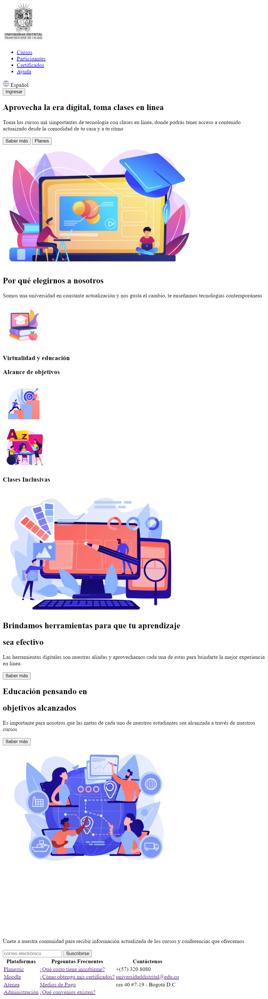
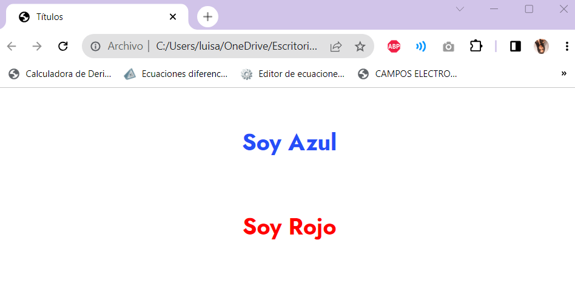
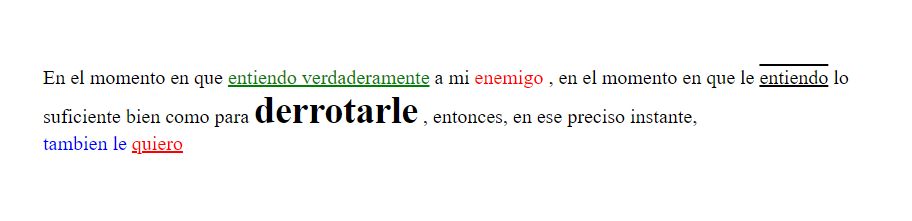
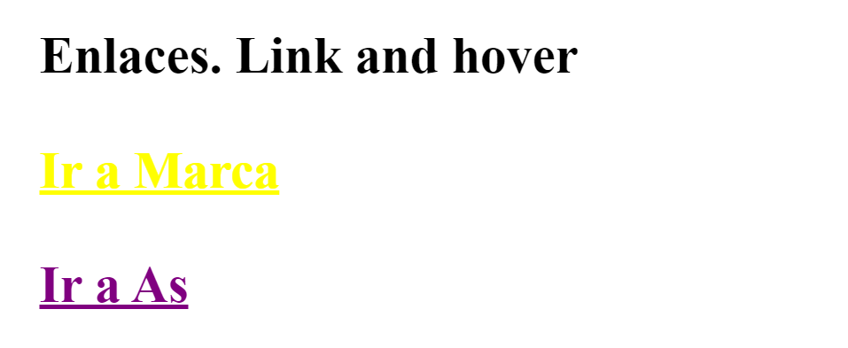
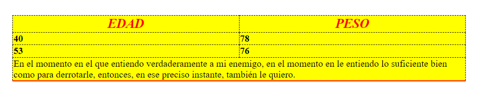
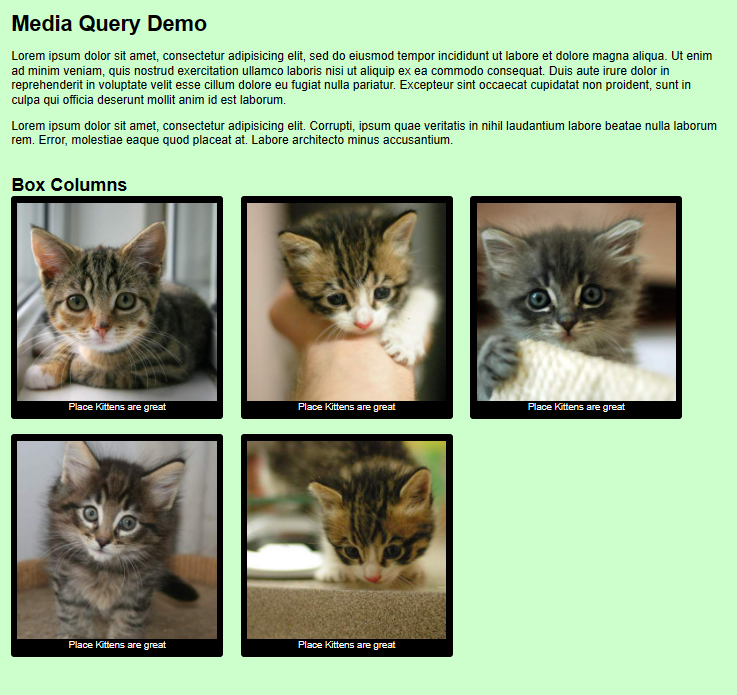

<h1>Taller No. 9 Mileidy Natali Diaz Cuervo </h1>

<h2> Información </h2>

 Curso: Full Stack Básico - Grupo No. 1

Profesor: Cristian Patiño

<h3>Link Página Web</h3>
<a href=" https://mileeeed.github.io/Taller-9-full-stack/" target="_blank">Link Página Web</a>
<h2> Punto No. 1: Link figma </h2>
<a href ="https://www.figma.com/file/CUJ2XTQoyq8VbWwX5i1AV8/Mileidy-Diaz---Figma-Exercise?type=design&node-id=0%3A1&mode=design&t=CkJnb53DZFWtJdIh-1" target ="_blank"> Link de Figma </a>

Diseñar y desarrollar un wireframe de una página web, la cual cuente con diversas secciones, un menú principal que permite navegar entre las secciones.

<h2> Punto No. 2: HTML </h2>

Organizar los archivos, imágenes, herramientas y carpetas utilizando buenas prácticas de programación.

<h2> Punto No. 3: Desarrollo con CSS de Mockup en HTML</h2>

Con base en el wireframe diseñado y los recursos obtenidos, desarrolle una interfaz web que contenga principios de diseño, utilice las etiquetas HTML necesarias y en el orden correcto, así mismo, utilice el CSS que requiera adecuado para la página web.

<h2>Punto No. 4: Visualización de Títulos</h2>

Escribir el documento HTML y las reglas CSS necesarias para visualizar el siguiente texto en el navegador.

<h2>Punto No.5:</h2> 

Escribir el documento HTML y las reglas CSS necesarias para visualizar el siguiente texto en el navegador.

<h2>Punto No. 6: Enlaces</h2>

Escribir el documento HTML y las reglas CSS necesarias para visualizar el siguiente texto en el navegador.

<h2>Punt No. 7-8: Menú de Navegación:</h2>

Escribir el documento HTML y las reglas CSS necesarias para visualizar el siguiente texto en el navegador.

<h2>Punto No. 9:</h2> 

Escribir el documento HTML y las reglas CSS necesarias para visualizar el siguiente texto en el navegador.

<h2>Punto No. 10:</h2>

Aplicar los estilos necesarios para que el documento html se visualice correctamente en cualquier dispositivo.

